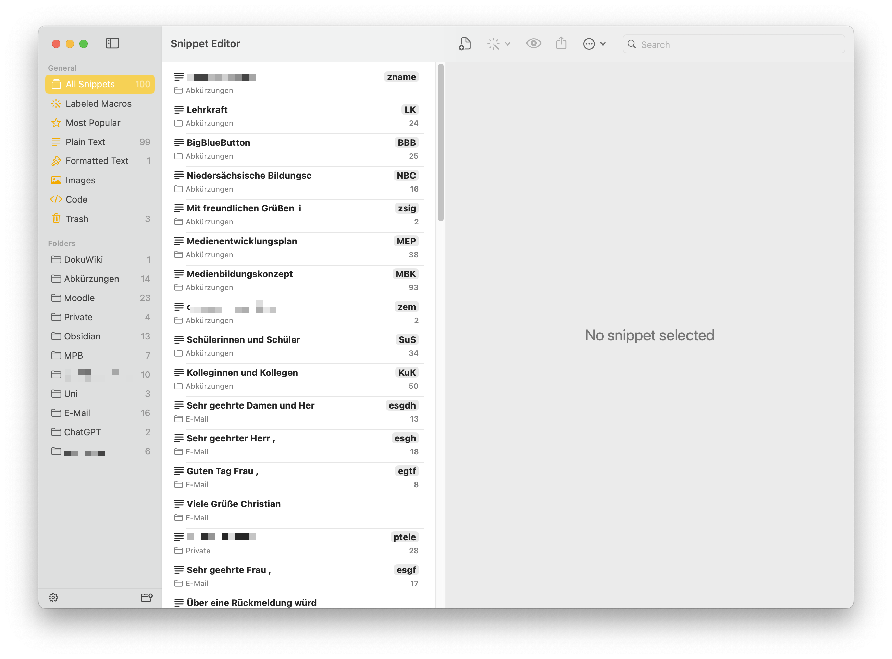
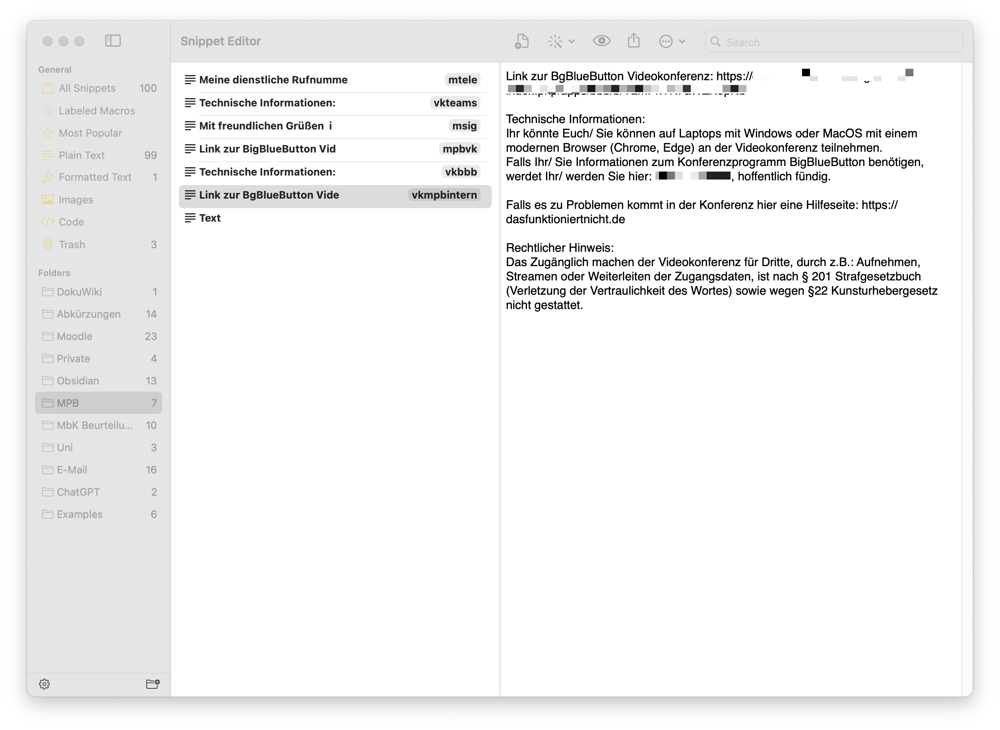

# Zeitsparen mit Texterweiterungen  

_13.10.2023_

## Was ist Texterweiterung (Textexpension)?
Texterweiterung, auch bekannt als Textexpansion, ist eine Technologie, die dazu dient, die Effizienz und Geschwindigkeit des Tippens zu steigern, indem vordefinierte Abkürzungen oder Auslöser durch vollständige Phrasen, Sätze oder sogar Absätze ersetzt werden. Dies geschieht automatisch und in Echtzeit, sobald der Benutzer die festgelegte Abkürzung oder den Auslöser eingibt. Texterweiterungen können in einer Vielzahl von Kontexten nützlich sein, insbesondere in Berufsfeldern, in denen häufig wiederkehrende Textblöcke oder spezielle Fachbegriffe verwendet werden, wie beispielsweise im Bildungsbereich, im Kundenservice oder in der Programmierung. Durch die Minimierung der Notwendigkeit, wiederholt denselben Text manuell einzugeben, ermöglicht die Texterweiterung eine erhebliche Zeitersparnis und reduziert gleichzeitig die Belastung der Handgelenke und Finger, die durch wiederholtes Tippen entstehen kann.

Hier finden Sie einige Beispiele: 

> esgdh = Sehr geehrte Damen und Herren,

> SuS = Schülerinnen und Schüler

> KuK = Kolleginnen und Kollegen


oder auch komplexer, wenn man zum Beispiel mit Moodle arbeitet:

maccordion = 

```html
<div id=""accordion"">
<div class=""card"">
<div class=""card-header"" id=""headingOne"">
<h3 class=""mb-0""><button class=""btn btn-link"" data-toggle=""collapse"" datatarget=""#collapseOne"" aria-expanded=""true"" aria-controls=""collapseOne"">
Ausklappbarer Inhalt 1 </button></h3>
</div>
<div id=""collapseOne"" class=""collapse show"" aria-labelledby=""headingOne"" dataparent=""#accordion"">
<div class=""card-body"">Hier ist ein Beispieltext ...</div>
</div>
</div>
<div class=""card"">
<div class=""card-header"" id=""headingTwo"">
<h3 class=""mb-0""><button class=""btn btn-link collapsed"" data-toggle=""collapse"" datatarget=""#collapseTwo"" aria-expanded=""false"" aria-controls=""collapseTwo"">
Ausklappbarer Inhalt 2 </button></h3>
</div>
<div id=""collapseTwo"" class=""collapse show"" aria-labelledby=""headingTwo"" dataparent=""#accordion"">
<div class=""card-body"">Weiterer Text</div>
</div>
</div>
</div>
``````

## Wie kann Texterweiterungen Lehrkräfte entlasten?

Texterweiterungen bieten Lehrkräften eine effiziente Möglichkeit, ihre administrativen und kommunikativen Aufgaben zu beschleunigen und somit wertvolle Zeit zu sparen. Lehrerinnen sind oft mit einer Fülle von schriftlichen Aufgaben konfrontiert, von der Kommunikation mit Schülerinnen, Eltern und Kolleg*innen bis hin zur Erstellung von Unterrichtsmaterialien und Berichten. Durch die Implementierung von Texterweiterungen können sie Standardformulierungen, Begrüßungen, Erklärungen und Feedback-Kommentare vordefinieren und diese mit nur wenigen Tastenanschlägen abrufen. Dies minimiert nicht nur den Zeitaufwand für das Tippen, sondern reduziert auch mögliche Tippfehler und sorgt für eine konsistente Kommunikation. Beispielsweise könnten Abkürzungen wie "SuS" automatisch zu "Schülerinnen und Schüler" expandieren oder ein Kürzel wie "mB" könnte zu einer vollständigen Muster-E-Mail für Benachrichtigungen über bevorstehende Elternabende umgewandelt werden. Dies ermöglicht den Lehrkräften, sich auf den pädagogischen Aspekt ihrer Arbeit zu konzentrieren, während administrative Aufgaben effizienter gestaltet werden.

## Wie funktionieren Texterweiterungsprogramme?

Texterweiterungsprogramme arbeiten nach einem simplen, aber effektiven Prinzip: Sie ersetzen kurze, vom Benutzer definierte Abkürzungen oder Auslöser automatisch durch längere Textblöcke, Sätze oder sogar Bilder. Dies ermöglicht es, häufig verwendete Phrasen, Code-Snippets oder Antworten mit nur wenigen Tastenanschlägen einzufügen, was den Schreibprozess erheblich beschleunigt und vereinfacht.

## Warum Rocket Typist?

In den letzten Jahren habe ich verschiedene Programme getestet und mich letztendlich für Rocket Typist entschieden. Ein ausschlaggebender Grund für diese Wahl war das kürzlich veröffentlichte Update, welches den Einsatz des Programms auf iOS und iPad ermöglicht. Daher möchte ich Ihnen das Konzept von Texterweiterungen anhand von Rocket Typist vorstellen.

## Funktionsweise von Rocket Typist

Rocket Typist dient als zentrales Repository für Text- und Bildschnipsel (Snippets) und ermöglicht es, diese effizient zu organisieren und zu bearbeiten. Snippets können in Ordnern sortiert und in verschiedenen Typen, wie reinem Text, formatiertem Text, Code und Bildern, erstellt werden. Darüber hinaus unterstützt Rocket Typist Makros, um Snippets dynamisch und vielseitig zu gestalten, indem es beispielsweise aktuelle Daten, Texteingaben während der Nutzung oder auch Inhalt aus der Zwischenablage einfügt. Diese Snippets können dann überall auf Ihrem Mac, iPhone oder iPad eingefügt werden, wobei die Synchronisation über iCloud erfolgt, um Konsistenz über alle Geräte hinweg zu gewährleisten.



## Einsatz von Texterweiterungen in der Praxis

Texterweiterungen können in vielfältiger Weise eingesetzt werden, um die Arbeit zu beschleunigen. Jede Sekunde, die ich durch den Einsatz von Texterweiterungen spare, kann ich für andere Aufgaben nutzen. Auch wenn eine oder zwei Sekunden zunächst nicht viel erscheinen mögen, summiert sich die eingesparte Zeit über ein ganzes Jahr betrachtet erheblich. Mit Rocket Typist kann ich Ordner einrichten und diese für unterschiedliche Schwerpunkte konfigurieren. So habe ich verschiedene für mich relevante Bereiche abgebildet, z. B.: Abkürzungen, Moodle Code Snippets oder E-Mail Textvorlagen, um nur einige zu nennen.




## Abschluss und eine kleiner "pitch" für das Konzept

Das Zeitalter der Digitalisierung bringt ständig neue Werkzeuge und Technologien hervor, die darauf abzielen, unsere täglichen Aufgaben effizienter und einfacher zu gestalten. Texterweiterungen, wie sie von Rocket Typist angeboten werden, sind ein Paradebeispiel für solche Innovationen. Sie bieten nicht nur eine Möglichkeit, den Schreibprozess zu beschleunigen, sondern auch, die Qualität und Konsistenz der Kommunikation zu verbessern.

Um die tatsächliche Zeitersparnis durch Texterweiterungen zu veranschaulichen, betrachten wir ein einfaches Beispiel: Ein Lehrer, der täglich E-Mails an Schüler, Eltern und Kollegen sendet, verwendet häufig wiederkehrende Phrasen oder Abschnitte. Wenn dieser Lehrer für jede E-Mail nur 5 Minuten benötigt und durch den Einsatz von Texterweiterungen diese Zeit um nur 20% reduzieren kann, spart er täglich etwa eine Minute pro E-Mail. Bei 20 E-Mails pro Tag entspricht dies einer täglichen Ersparnis von 20 Minuten. Über ein Schuljahr mit rund 200 Schultagen summiert sich dies zu einer beeindruckenden Ersparnis von etwa 66 Stunden oder fast 3 vollen Arbeitstagen.

Diese Zeitersparnis kann dann für wichtigere pädagogische Aufgaben, für die Vorbereitung des Unterrichts oder für die individuelle Betreuung von Schülern verwendet werden. Es ist klar, dass solche Technologien, wenn sie effektiv eingesetzt werden, nicht nur die Effizienz steigern, sondern auch die Qualität der Bildung verbessern können, indem sie Lehrern mehr Zeit für das Wesentliche geben.

Abschließend lässt sich sagen, dass die Wahl des Tools, sei es Rocket Typist oder ein Konkurrent, letztendlich von den individuellen Bedürfnissen und Vorlieben abhängt. Es ist essentiell, sich mit solchen Hilfsmitteln auseinanderzusetzen und zu prüfen, ob sie den eigenen Workflow effektiv unterstützen können. Wir sollten IT und Software stets zu unserem Vorteil nutzen, um so wertvolle Lebenszeit zu sparen und für andere, möglicherweise bedeutungsvollere Aktivitäten einsetzen zu können.

---

Für Interessierte ist [Rocket Typist](https://www.witt-software.com/rockettypist/) für einmalige 20€ erhältlich und könnte ein erster Schritt in Richtung einer effizienteren Arbeitsweise sein.

> [Rocket Typist](https://www.witt-software.com/rockettypist/)

-----

> Dieser Artikel steht unter der Creative Commons Lizenz CC-BY-4.0 und darf unter Angabe der Urheberschaft frei geteilt, verbreitet und bearbeitet werden.
> CC-BY-4.0 Christian Haake