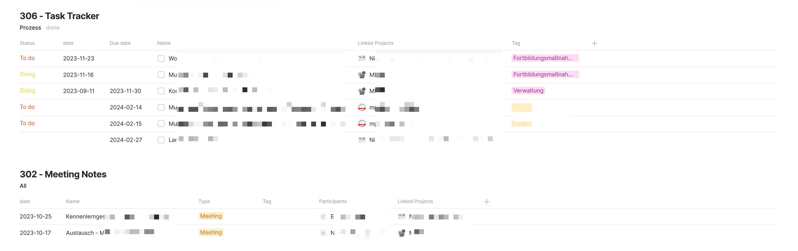

# Ein Dashboard in Anytype
In einem meiner vorherigen Artikel habe ich das PARA-System vorgestellt, welches eine effektive Methode zur Informationsorganisation darstellt. [Lesen Sie mehr darüber in meinem Artikel zu PARA in Anytype](https://haak3.de/articles/2023_Anytype/2023_Anytype-mit-PARA/2023_Using-PARA-with-Anytype.html). 

Um jedoch sicherzustellen, dass man rasch alle benötigten Informationen erhält und seine Ziele effizient verfolgen kann, ist ein Dashboard unerlässlich. Ein solches Dashboard dient als zentrale Übersicht und erleichtert den Zugriff auf die wichtigsten Informationen und Aufgaben. 

In Anytype habe ich ein solches Dashboard erstellt, welches ausschließlich auf Inline-Sets basiert. Der Vorteil dabei ist, dass sich das Dashboard automatisch anpasst, je nachdem wie sich meine Informationen und Aufgaben verändern. Dies gewährleistet stets eine aktuelle und relevante Übersicht, die mir hilft, effizient und fokussiert zu arbeiten.

## Dashboard Übersicht

Das Dashboard in Anytype ist so konzipiert, dass es eine klare und strukturierte Übersicht über verschiedene Aspekte Ihrer Arbeit bietet. Es besteht aus fünf Hauptblöcken, die ich im Folgenden Schritt für Schritt erläutern werde:

1. **Projekte und Areas**: Dies ist der erste Block des Dashboards. Hier finden Sie alle laufenden und geplanten Projekte sowie die dazugehörigen Arbeitsbereiche (Areas). Dieser Block gibt Ihnen einen schnellen Überblick über Ihre Hauptaufgaben und Prioritäten.

2. **Resources**: Im zweiten Block werden alle Ressourcen aufgelistet, die Sie für Ihre Projekte und Aufgaben benötigen. Dies können Dokumente, Links, Tools oder andere Materialien sein, die für die erfolgreiche Durchführung Ihrer Projekte wichtig sind.

3. **Prozesse**: Diese repräsentieren umfangreiche Abläufe von unterschiedlichen Projekten und stellen nicht einzelne Aufgaben dar.

4. **Meetingnotes**: Der vierte Block ist den Notizen und Protokollen aus Meetings gewidmet. Hier können Sie alle wichtigen Informationen, Entscheidungen und nächsten Schritte aus Ihren Besprechungen festhalten und leicht darauf zugreifen.

# PARA Überblick

# Sources Überblick

# Prozess & Meeting Überblick

-----

Obwohl Anytype sich noch in der Beta-Phase befindet, läuft die Software äußerst stabil und zuverlässig. Ich habe bisher keinerlei Probleme im Umgang damit erlebt und finde die Anwendung sehr benutzerfreundlich und effizient. Für alle, die an einem innovativen Tool für das Wissensmanagement und die Informationsorganisation interessiert sind, ist Anytype definitiv einen Blick wert. Die Software kann auf der Webseite Anytype.io heruntergeladen werden.

-----

> Dieser Artikel steht unter der Creative Commons Lizenz CC-BY-4.0 und darf unter Angabe der Urheberschaft frei geteilt, verbreitet und bearbeitet werden.
> CC-BY-4.0 Christian Haake

Changelog:
- inital 