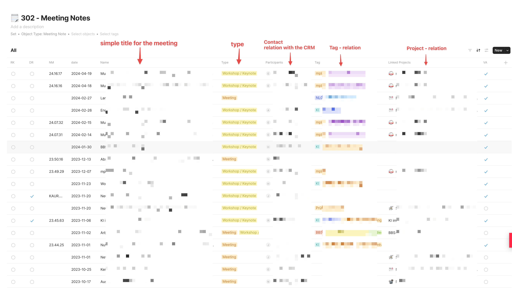

# Meetingnotes Management mit Anytype

## Meetingnotes Set

Anytype zeichnet sich durch seine hohe Flexibilität aus, die es Benutzern ermöglicht, das Tool nach ihren spezifischen Bedürfnissen zu strukturieren. Dies führte zur Erstellung eines neuen Objekts namens "Meeting Note", unter dem jedes neue Meetingnote erfasst wird. Um Konsistenz zu gewährleisten, wird für Meetingnotes stets dasselbe Template verwendet. Dies erleichtert den Prozess und sorgt für einheitliche Zusatzinformationen bei jedem Eintrag.

Die Meetingnotes werden in einem Set, das als "Meeting Notes" bezeichnet wird, gesammelt. Dieses Set fungiert als eine Datenbank, in der alle Meetingnotes organisiert sind. Der Table-View wird bevorzugt, da er eine klare Übersicht über alle Einträge bietet und feste Spalten für Relationen oder zusätzliche Informationen enthält, die für spezifische Workflows erforderlich sind.

Einige Schlüsselfunktionen und Vorteile des Anytype Meetingnotes Systems sind:

- **Strukturierung nach Daten**: Die Meetingnotes sind in chronologischer Reihenfolge organisiert, wobei das neueste ganz oben steht. Dies erleichtert den schnellen Zugriff auf aktuelle Notizen.
  
- **Unterscheidung nach Typ**: Meetingnotes können in verschiedene Typen unterteilt werden, z. B. "Workshop / Keynote" und "Meeting". Dies dient der schnellen Identifizierung des Meetinginhalts und fördert eine systematische Organisation. Der Relationstyp wird konsistent in allen Kontexten verwendet, in denen ein Typ ausgewählt werden kann, um Beständigkeit im System zu gewährleisten.

- **Beziehung zum CRM**: Jede Meetingnote hat eine direkte Verbindung zum CRM, in dem angegeben wird, wer an dem Meeting teilgenommen hat oder mit wem Gespräche geführt wurden. Dies ist besonders nützlich in Kombination mit dem CRM-Set, das Kontakte von allen Personen enthält, mit denen Kommunikation besteht. So können Benutzer auf der Kontaktseite einer Person alle Meetings und Gespräche anzeigen, an denen sie teilgenommen hat, und sich über die besprochenen Themen informieren.

- **Tag-Relation**: Themen-Tags werden konsistent über alle Bereiche des Systems hinweg verwendet. Meetingnotes werden mit Tags versehen, um sie thematisch zu kategorisieren, wodurch über die Monate hinweg ein Netzwerk thematischer Verknüpfungen entsteht.

- **Projekt-Beziehung**: Jede Meetingnote kann mit bestimmten Projekten verknüpft werden. Dies ist nicht nur für die Projektverwaltung und -verfolgung von Vorteil, sondern ermöglicht auch die Anzeige dieser Meetingnotes auf den jeweiligen Projektseiten.

## Vorlage für Meetingnotizen

Die effektive Führung von Meetingnotizen erfordert eine klare und einfache Struktur, die es ermöglicht, alle notwendigen Informationen schnell und effizient zu erfassen. Bei der Gestaltung meiner Vorlage für Meetingnotizen habe ich mich auf die wesentlichen Bestandteile konzentriert, die für die Dokumentation und Nachverfolgung von Besprechungsergebnissen unerlässlich sind. 

Das Herzstück der Vorlage ist ihre Schlichtheit. Der Hauptzweck ist es, den Inhalt in den Vordergrund zu stellen und den Nutzern zu ermöglichen, sich auf das Wesentliche zu konzentrieren. Daher gibt es einige unverzichtbare Eingabefelder, wie das Datum des Meetings, den Typ und die beteiligte Person. Diese Felder bieten einen schnellen Überblick über den Kontext der Besprechung und helfen bei der Kategorisierung und Archivierung der Notizen.

----

Even though Anytype is still in its beta phase, the software operates extremely smoothly and reliably. I have encountered no issues while using it and find the application to be very user-friendly and efficient. For anyone interested in an innovative tool for knowledge management and information organization, Anytype is definitely worth exploring. The software can be downloaded from the Anytype.io website.

----

> This article is licensed under the Creative Commons License CC-BY-4.0 and may be freely shared, distributed, and edited with attribution of authorship.
> CC-BY-4.0 Christian Haake

Changelog:
- inital 