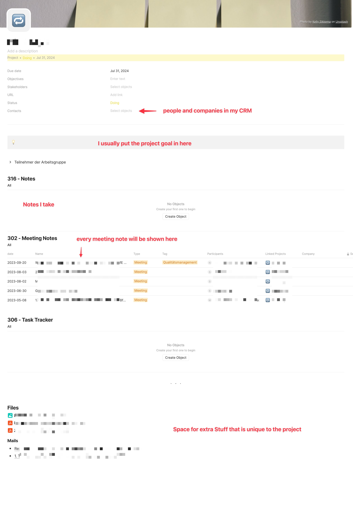
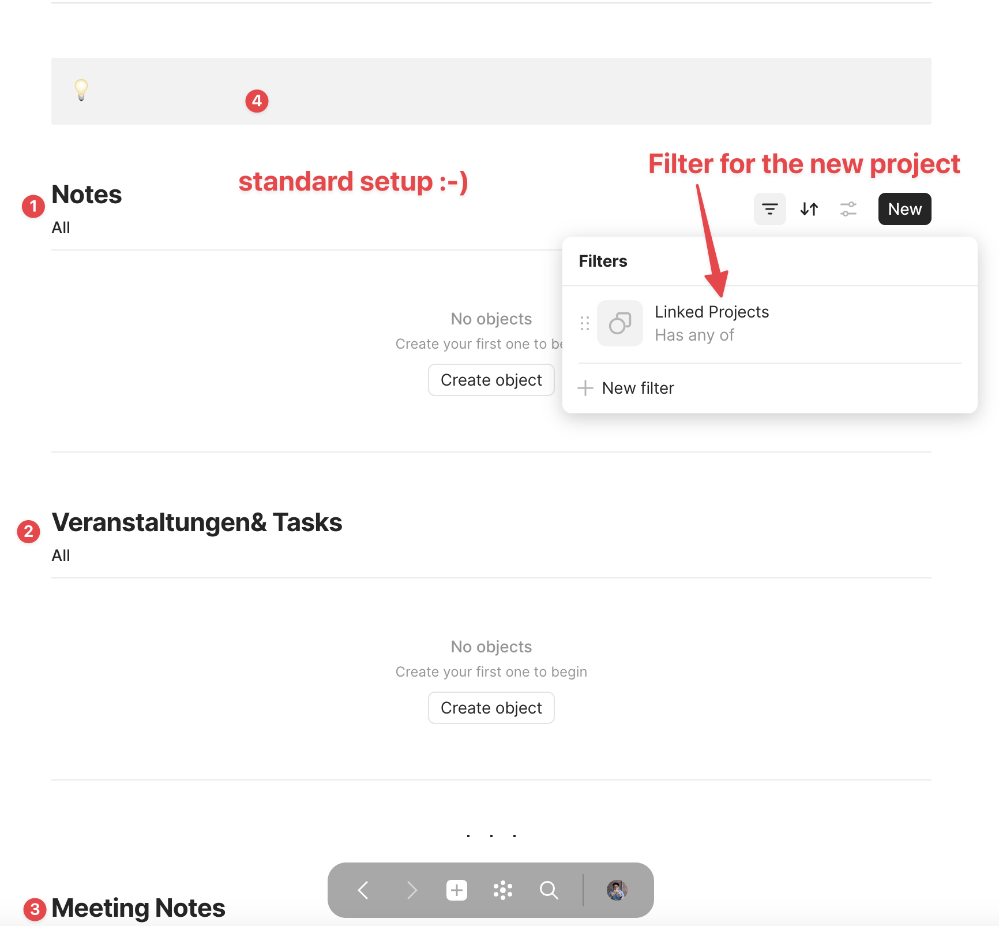
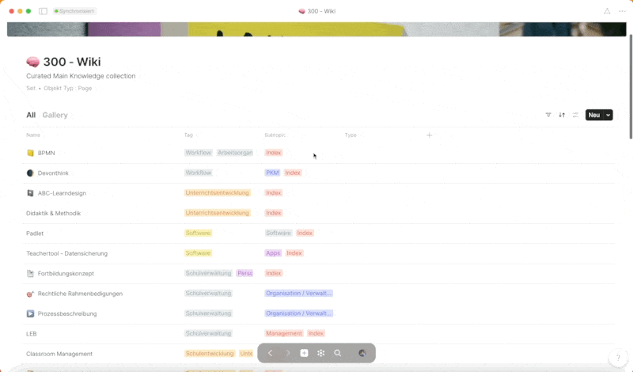

# Application of PARA and CODER with Anytype
__10/2023__

Anytype, as an advanced note-taking app, not only combines the robust data management features of Notion but also integrates the "on-device" premise of Obsidian, allowing users to manage their data locally and without mandatory cloud storage. This combination ensures that information does not exist in isolation but in a network of links, thereby enabling it to be viewed and utilized in different contexts and from various perspectives – or in Anytype terminology, "Views". The ability to structure data through "Sets" and "Relations" allows users to develop complex semantic structures that maximize the value of the connected information.

In terms of knowledge management, Anytype provides a platform that not only enables the organization of information but also its linkage and rediscovery in an intuitive and user-friendly format. The ability to create one's own object types and relationships between them promotes clear organization and intuitive navigation, especially in information-dense and complex projects. Here, the value of information is particularly emphasized when it is related to others, thus forming a network of knowledge and data that can be made visible from various "Views".

The PARA concept, which divides information into the categories of Projects, Areas, Resources, and Archives, provides a structuring level that organizes processes and knowledge in a clear and comprehensible manner. This structuring can be effectively represented in Anytype, especially through the use of Sets, Tags, Relations, and status displays, to create a clear and navigable knowledge database. This approach to implementing PARA in Anytype, with particular emphasis on linking and visualizing information, will be detailed in the course of this article.

> In my five years of intensive engagement with knowledge management tools, especially during my activity as a teacher and media-pedagogical consultant for the NLQ, I have explored the depths of Notion and Obsidian and acquired comprehensive conceptual knowledge in this area. Anytype has emerged as a platform that allows me to effectively apply this knowledge by enabling a connected representation of information.

## 1. Theoretical Framework: The PARA Approach

The PARA approach, developed by productivity expert Tiago Forte, provides a structured framework for knowledge management and the organization of information, revolutionizing information organization through its clear and purposeful structure. PARA, an acronym for Projects, Areas, Resources, and Archives, defines four main categories of information organization. "Projects" are time-limited, goal-oriented endeavors, "Areas" represent continuous, long-term aspects of life or work, "Resources" encompass collections of information and knowledge to support projects and areas, and "Archives" house information that is not currently needed but is retained for future reference.

The PARA approach aims to create a clear and flexible structure that enables information to be organized, stored, and retrieved efficiently, taking into account both current and future needs. By dividing information into the four categories, PARA enables an intuitive and systematic organization of knowledge and data. "Projects" provide a framework for current, goal-directed activities, while "Areas" provide a structure for ongoing, long-term commitments. "Resources" serve as a knowledge bank to support projects and areas, and "Archives" ensure that even non-active, but potentially future-relevant knowledge is preserved. This structuring allows information to be categorized, stored, and retrieved efficiently, optimizing access to knowledge and facilitating its application in various contexts. Thus, the PARA approach not only promotes the efficient management of information but also agile and adaptive use of knowledge across different life and work areas.

## 2. Application of the PARA Approach in Anytype

**Projects**

In applying the PARA approach in Anytype, the structural level plays a crucial role in enabling a clear, systematic, yet flexible organization of information and knowledge. The implementation begins with the creation of its own object, which I have simply named "Projects." This object serves as a central unit for managing and organizing both projects and areas (AREAS). The distinction between these two categories is made using tags, specifically by using the tags "Project," "AREA," and "ARCHIVE." These tags not only enable a clear differentiation but also a flexible adaptation and expansion of the system.

Various relations are attached to the "Projects" object, enabling a versatile and dynamic organization of information. These relations are not rigid but can be adapted according to individual needs and specific requirements. They serve to link relevant information, documents, and additional resources directly with the respective project or area, thereby creating a central and simultaneously structured information source. The integration of relations also ensures a dynamic and context-related linking of data, supporting efficient navigation and information uptake. Thus, the structural implementation of PARA in Anytype, through the use of special objects and tags, enables a clear, systematic, and simultaneously flexible organization of my work areas.

**Project Pages**

At the heart of applying PARA in Anytype is the "Project" object, which is used for both projects and areas (AREAs). Each individual project or area is represented by its own object, built according to a uniform template.

This template consists of various tags and inline sets, which allow a representation of sets on a single page. These inline sets represent object sets from the "Resources" area and can display a variety of content, such as meeting notes, notes, CRM data, and other resource-related content. A crucial aspect here is the ability to filter content-related resources using tags. This enables a clear and focused display of information that is specifically relevant to the respective project or area.

A critical point, which is particularly worth highlighting, concerns the self-filtering of all inline sets. As can be seen in the attached screenshots, the inline sets filter themselves out, ensuring a clear and uncluttered display of relevant information and simultaneously enabling efficient navigation within the "Project" object.

**AREAS**

In the application of Anytype, "Areas" are a fundamental component, which, similar to "Projects," are represented by the object type "Projects." Despite their similarity in structuring and presentation, "Areas" and "Projects" have a crucial difference: the specifically set tag "AREAS" for Areas. This tag not only serves for clear distinction but also for specific organization and navigation within Anytype.

The pages of "Areas" fundamentally follow the same structure as those of "Projects." However, they usually contain more specific subpages and information, aiming at the continuous and comprehensive character of Areas. While "Projects" are often time-limited and goal-oriented, "Areas" represent ongoing, long-term engagements or life areas that require a deeper and more comprehensive information structure. For instance, "Areas" can represent specific knowledge areas, continuous activities, or permanent commitments, which are detailed through a variety of subpages and linked information.

------

The application of the PARA approach in Anytype, especially in the context of "Areas" and "Projects," serves in my logic primarily to filter and organize knowledge and information specifically. Here, "Areas" and "Projects" should not act as isolated information islands but rather as filters through which data from "Resources" are specifically referenced. The goal is to refer to information from "Resources" as far as sensible, to be able to reuse them in different contexts.

> An example for clarification: In "Resources," I have created a CRM set in which all contacts, whether persons or companies, are stored. This information is then available to all "Projects" and "Areas" and can be referenced at any time. I proceed similarly with meeting notes: These are stored as a set in "Resources" and can be linked through a "Relation" with "Areas," "Projects," and of course, with contacts in the CRM.

Through this structure, a flexible and context-related use of information is enabled, ensuring both the efficiency and consistency of data maintenance and use. In the next section, I will introduce the "Resources" area and particularly go into the structuring and application of the data stored there.

---

**Resourcen**

### The Extensive “Resources” Section in the PARA Approach

The “Resources” section in the PARA approach plays a pivotal role as a collective pool for all content, forming the foundation for the information and knowledge organization within “Projects” and “Areas.” “Resources” act as an extensive database from which the two aforementioned areas draw and which accommodates a variety of content. This includes, for example, notes (Notes), meeting notes (Meetingnotes), bookmarks (Bookmarks), documents (Documents), products (Products, in the sense of “Stuff I produce”), training materials (Trainings), customer relationship management data (CRM), a library (Library), and ideas (Ideas).

Except for “Pages” objects, which are directly presented as pages, all content is organized in its own sets to ensure a clear and structured organization of the diverse information. These sets enable systematic organization while also providing the flexibility required for effective knowledge management. A visual overview of the various sets and their structuring within “Resources” can be seen in the attached screenshot.

The structuring and organization of “Resources” are crucial to enable efficient and sustainable use of the collected information and data in “Projects” and “Areas.” Through the clear separation and simultaneously flexible linking of content, a dynamic and context-related use of “Resources” in various areas and projects is enabled.

**Pages in the Wiki**

In my logic, "Pages" objects in Anytype are closely linked to a specific topic and serve to bundle and present information relevant to that topic in a structured manner. These "Pages" are displayed in a wiki, which is characterized not only by names but also by tags. Moreover, I assign a "Type" to most "Pages" objects, defined as "Index". The Wiki set filters for "Pages" objects that have the "Type" "Index" to ensure a clear and navigable structure in the Wiki.

These "Pages" objects act as structured collections of information that are topic-bound and are provided with various "Inline-Sets". Examples of such "Inline-Sets" are "Notes", "Library", "Bookmarks", "Documents", and more, each filtered according to the respective tag. Here, the concept of "Tags" plays a central role in my system and forms, as you will notice throughout this post, the backbone of the information structure.

"Tags" are set in almost every object and are defined according to thematic keywords. They allow filtering from every perspective according to this tag, thus offering flexible and context-related navigation through the information stored in Anytype. Through the consistent use of "Tags", a continuous, theme-based structuring and findability of information is ensured, facilitating the efficient use and reuse of knowledge in various contexts.

## 3. Linking PARA and CODER: A Coherent Approach to Information Management and Development

While we regard the PARA approach as a sturdy framework for categorizing and organizing our information, the CODER concept provides a dynamic process that guides us through the phases of information and knowledge development. It's vital to recognize that these two concepts do not exist in isolation but rather in a symbiotic relationship that facilitates the flow of knowledge and information through various phases of management and development.

PARA enables us to organize information in a clear and navigable structure, thereby establishing a solid foundation for the CODER process. With a well-organized information base provided by PARA, we can navigate through the phases of the CODER concept, starting with collecting information, through its organization and distillation, to expression, and ultimately to reflection and further development.

In this context, PARA acts as the foundation upon which our information is securely and structurally stored, while CODER serves as the mechanism that guides us through the cyclical process of knowledge creation, sharing, and reflection. Integrating PARA and CODER in Anytype allows us to develop a comprehensive and continuous approach to knowledge management that supports not only the organization but also the development and enhancement of our knowledge and information.

## 4. Introduction to the CODER Concept

The CODER concept represents a methodical approach to effective knowledge management and learning, passing through five central phases: Collect, Organize, Distill, Express, and Reflect.

- **Collect:** In this initial phase, the focus is on gathering relevant information and knowledge from various sources. It's about accumulating a wide range of data, facts, and knowledge that are significant for a particular topic or project.

- **Organize:** Here, the collected information and data are organized in a structured form to make them easily accessible and findable.

- **Distill:** This phase involves reducing and condensing the collected knowledge to the most essential and relevant points.

- **Express:** Here, the distilled knowledge is communicated in a clear and understandable form, whether through notes, articles, videos, or other media formats.

- **Reflect:** In the final phase, a reflection on the learned as well as the entire learning and knowledge management process takes place to deepen understanding and optimize future learning processes.

The CODER concept influences knowledge management and learning by providing a cyclical and reflective process. It enables users to actively collect, organize, distill, and express knowledge, while continuous reflection promotes deeper understanding and steady improvement of learning processes. This approach not only supports individual learning and knowledge management but can also be implemented in tools like Anytype to support and optimize the process of knowledge curation and organization.

## 5. Applying the CODER Approach in Anytype

The CODER concept, developed as a methodological approach for effective knowledge management and learning, undergoes five central phases: Collect, Organize, Distill, Express, and Reflect. Each phase plays a pivotal role in the way information and knowledge are gathered, processed, applied, and reflected upon.

- **Collect: Systematic Gathering**

In the "Collect" phase, the objective is to capture everything that is relevant with the appropriate object type in Anytype. Here, a wide range of data, facts, and knowledge that are significant for specific topics or projects are accumulated. The art lies in finding a balance between collecting enough material to make informed decisions and avoiding information overload.

- **Organize: Structured Filing in Resources**

The "Organize" phase finds its parallel in "Resources" within the PARA approach in Anytype. Here, information is not only collected but also organized in a structured form, such as in wikis or notes. This ensures easy accessibility and findability of the data when needed.

- **Distill: Condensation through Readwise**

In the "Distill" phase, the collected knowledge is reduced to the most essential and relevant points. Here, the Readwise reader is used, with the hope that a future plugin will enable automated integration of all information into the system.

- **Express: Production and Sharing of Content**

"Express" encompasses everything that is produced: articles, keynotes, workshops, tutorials, etc. These outputs are recorded in Anytype in the "Products" set with the "Product" object. Here, the distilled knowledge is communicated and shared in a clear and understandable form, whether internally for projects or externally for a wider audience.

- **Reflect: Continuous Improvement**

The "Reflect" phase is still an unsolved puzzle in the system. It involves reflection and continuous improvement of one's own learning process and thoughts. The challenge is to find a method or tool that supports sustainable and effective reflection processes.

## 6. **Conclusion**

The integration of PARA and CODER with Anytype has emerged as an innovative method for optimizing knowledge management and information organization. By combining Anytype's robust data management capabilities with the clear and purposeful structuring methods of PARA and CODER, users can create a network of information that is not only well-organized but also easily accessible and adaptable.

Anytype has proven to be a powerful tool for managing and organizing information and knowledge. With its ability to develop complex semantic structures through "Sets" and "Relations," it enables users to effectively structure and link their data, thereby maximizing the added value of connected information.

The application of the PARA concept in Anytype has demonstrated that a clear and systematic organization of projects and areas is possible, while the implementation of the CODER concept provides a methodical approach for collecting, organizing, distilling, expressing, and reflecting knowledge.

Looking to the future, the potential of Anytype and the further development of its functions remain an exciting field. With the hope for new plugins and features that enable even deeper integration and automation of processes, the path for continuous improvements and adjustments to the system remains open.

The journey with Anytype, PARA, and CODER is an ongoing discovery and adaptation, where systems and processes are constantly reconsidered and optimized to meet the changing requirements and developments in the field of knowledge management. It remains exciting to observe how these methods and tools will continue to evolve to meet the future challenges of the information age.

----

Even though Anytype is still in its beta phase, the software operates extremely smoothly and reliably. I have encountered no issues while using it and find the application to be very user-friendly and efficient. For anyone interested in an innovative tool for knowledge management and information organization, Anytype is definitely worth exploring. The software can be downloaded from the Anytype.io website.

----

> This article is licensed under the Creative Commons License CC-BY-4.0 and may be freely shared, distributed, and edited with attribution of authorship.
> CC-BY-4.0 Christian Haake

Changelog:
- 2023-10-12 Release
- 2023-10-15 Adding Linking PARA and CODER