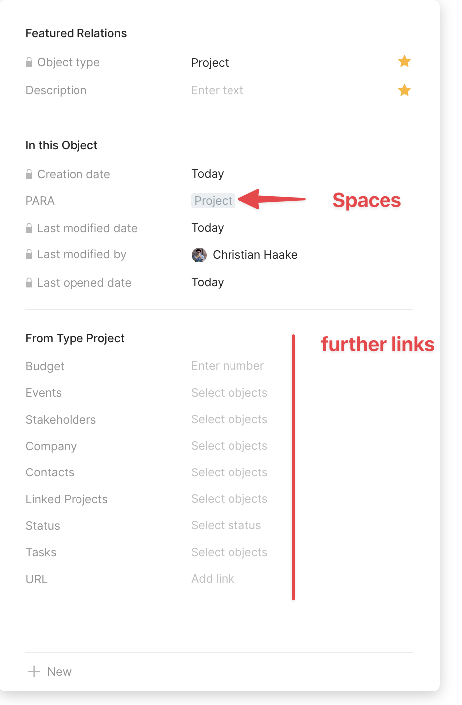
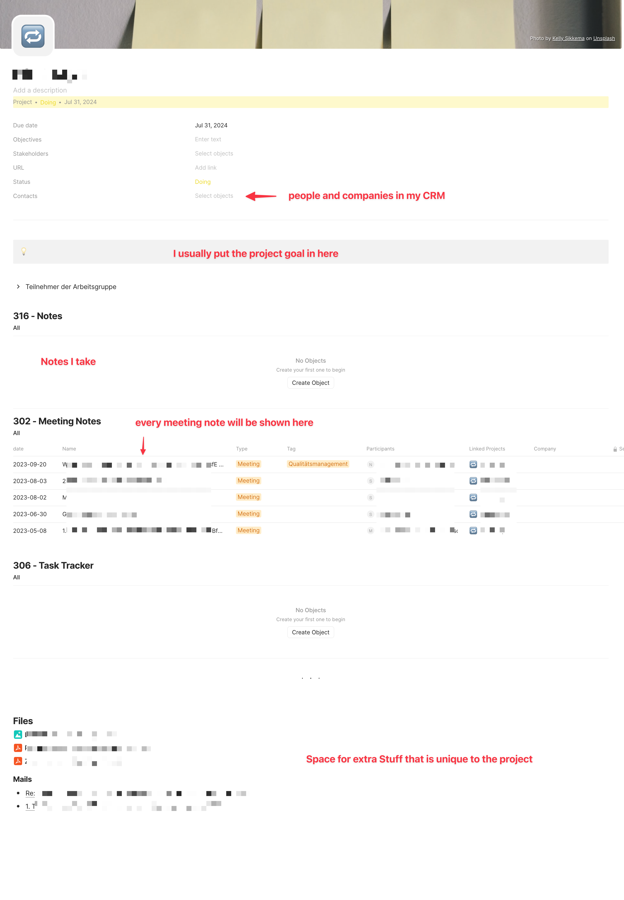
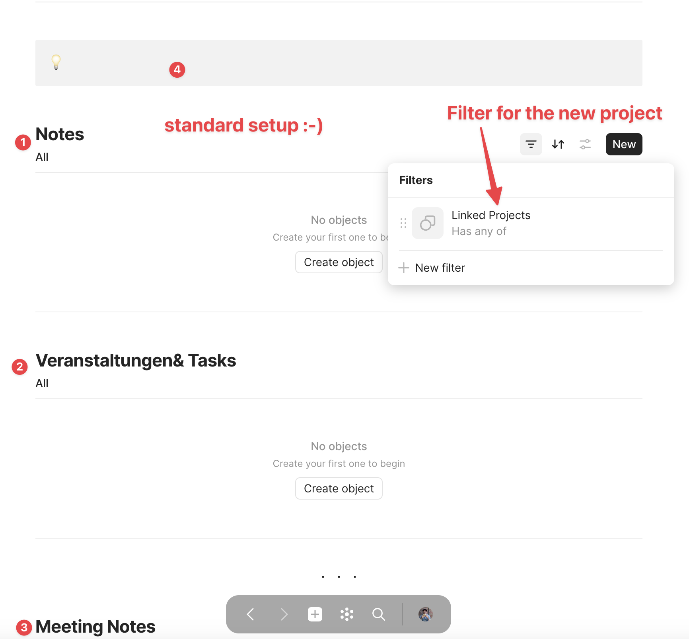
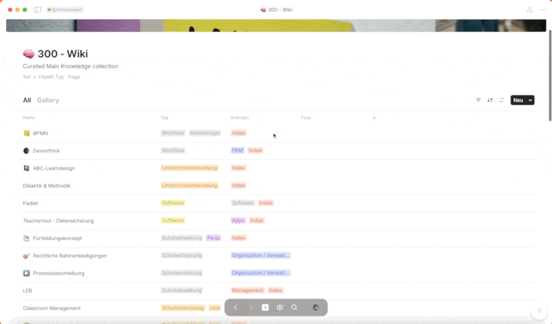
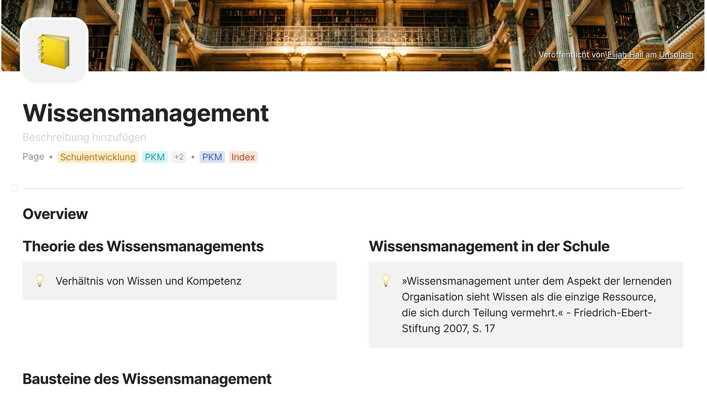
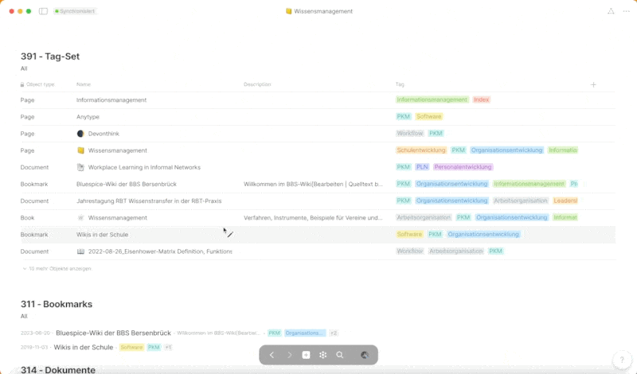

# Anwendung von PARA und CODER mit Anytype
__10/2023__

Anytype, als fortschrittliche Notiz-App, verbindet nicht nur die robusten Datenverwaltungsfunktionen von Notion, sondern integriert auch die „on-device“-Prämisse von Obsidian, wodurch Nutzer ihre Daten lokal und ohne zwingende Cloud-Speicherung verwalten können. Diese Kombination ermöglicht es, dass Informationen nicht isoliert, sondern in einem Netzwerk von Verknüpfungen existieren, wodurch sie in unterschiedlichen Kontexten und aus verschiedenen Perspektiven – oder in Anytype-Terminologie, „Views“ – betrachtet und genutzt werden können. Die Fähigkeit, Daten durch „Sets“ und „Relations“ zu strukturieren, erlaubt es den Nutzern, komplexe semantische Strukturen zu entwickeln, die den Mehrwert der vernetzten Informationen maximieren.

In Bezug auf Wissensmanagement bietet Anytype eine Plattform, die nicht nur die Organisation von Informationen ermöglicht, sondern auch ihre Verknüpfung und Wiederentdeckung in einem intuitiven und nutzerfreundlichen Format. Die Möglichkeit, eigene Objekttypen und Beziehungen zwischen diesen zu erstellen, fördert eine klare Organisation und intuitive Navigation, insbesondere in informationsdichten und komplexen Projekten. Hierbei wird der Nutzen von Informationen besonders hervorgehoben, wenn sie in Beziehung zu anderen stehen und somit ein Netzwerk von Wissen und Daten bilden, das aus verschiedenen „Views“ sichtbar gemacht werden kann.

Das PARA-Konzept, welches Informationen in die Kategorien Projekte, Bereiche, Ressourcen und Archive unterteilt, bietet eine Strukturierungsebene, die Prozesse und Wissen in einer klaren und nachvollziehbaren Weise organisiert. Diese Strukturierung kann in Anytype effektiv dargestellt werden, insbesondere durch die Verwendung von Sets, Tags, Relations und Statusanzeigen, um eine klare und navigierbare Wissensdatenbank zu schaffen. Dieser Ansatz zur Implementierung von PARA in Anytype, unter besonderer Berücksichtigung der Verknüpfung und Visualisierung von Informationen, wird im weiteren Verlauf dieses Artikels detailliert vorgestellt.

> In meinen fünf Jahren intensiver Auseinandersetzung mit Wissensmanagement-Tools, insbesondere während meiner Tätigkeit 
> als Lehrer und medienpädagogischer Berater für das NLQ, habe ich die Tiefen von Notion und Obsidian erkundet und 
> umfassendes konzeptionelles Wissen in diesem Bereich erworben. Anytype hat sich als Plattform herausgestellt, die es mir
> ermöglicht, dieses Wissen effektiv anzuwenden, indem es eine vernetzte Darstellung von Informationen ermöglicht.

## 1. Theoretischer Rahmen: Der PARA-Ansatz

Der PARA-Ansatz, entwickelt von Produktivitätsexperte Tiago Forte, bietet einen strukturierten Rahmen für das Wissensmanagement und die Organisation von Informationen, revolutioniert dabei durch seine klare und zweckmäßige Struktur die Informationsorganisation. PARA, ein Akronym für Projekte, Bereiche, Ressourcen und Archive, definiert vier Hauptkategorien der Informationsorganisation. „Projekte“ sind zeitlich begrenzte, zielorientierte Vorhaben, „Bereiche“ repräsentieren kontinuierliche, langfristige Lebens- oder Arbeitsaspekte, „Ressourcen“ umfassen Sammlungen von Informationen und Wissen zur Unterstützung von Projekten und Bereichen, und „Archive“ beherbergen Informationen, die aktuell nicht benötigt werden, jedoch für zukünftige Referenzen aufbewahrt werden. 

Der PARA-Ansatz zielt darauf ab, eine klare und flexible Struktur zu schaffen, die es ermöglicht, Informationen effizient zu organisieren, zu speichern und wiederzufinden, und dabei sowohl aktuelle als auch zukünftige Bedürfnisse berücksichtigt. Indem er Informationen in die vier Kategorien unterteilt, ermöglicht PARA eine intuitive und systematische Organisation von Wissen und Daten. „Projekte“ bieten einen Rahmen für aktuelle, zielgerichtete Aktivitäten, während „Bereiche“ eine Struktur für fortlaufende, langfristige Engagements bieten. „Ressourcen“ dienen als Wissensbank zur Unterstützung von Projekten und Bereichen, und „Archive“ gewährleisten, dass auch nicht aktives, aber potenziell zukünftig relevantes Wissen erhalten bleibt. Diese Strukturierung ermöglicht es, Informationen effizient zu kategorisieren, zu speichern und wiederzufinden, wodurch der Zugang zu Wissen optimiert und die Anwendung in verschiedenen Kontexten erleichtert wird. Der PARA-Ansatz fördert somit nicht nur die effiziente Verwaltung von Informationen, sondern auch eine agile und adaptive Nutzung von Wissen in unterschiedlichen Lebens- und Arbeitsbereichen.

## 2. Anwendung von des PARA-Ansatzes in Anytype

**Projects**

In der Anwendung des PARA-Ansatzes in Anytype spielt die strukturelle Ebene eine entscheidende Rolle, um eine klare, systematische und dennoch flexible Organisation von Informationen und Wissen zu ermöglichen. Die Implementierung beginnt mit der Schaffung eines eigenen Objekts, das ich schlicht „Projects“ genannt habe. Dieses Objekt dient als zentrale Einheit zur Verwaltung und Organisation sowohl von Projekten als auch von Bereichen (AREAS). Dabei erfolgt die Unterscheidung zwischen diesen beiden Kategorien mittels Tags, genauer gesagt durch die Verwendung der Tags „Project“, „AREA“ und „ARCHIVE“. Diese Tags ermöglichen nicht nur eine klare Differenzierung, sondern auch eine flexible Anpassung und Erweiterung des Systems. 

Dem „Projects“-Objekt sind verschiedene Relationen angehängt, die eine vielseitige und dynamische Organisation von Informationen ermöglichen. Diese Relationen sind nicht starr, sondern können je nach individuellen Bedürfnissen und spezifischen Anforderungen angepasst werden. Sie dienen dazu, relevante Informationen, Dokumente und weitere Ressourcen direkt mit dem jeweiligen Projekt oder Bereich zu verknüpfen, wodurch eine zentrale und gleichzeitig strukturierte Informationsquelle entsteht. Durch die Integration von Relationen wird zudem eine dynamische und kontextbezogene Verknüpfung von Daten gewährleistet, die eine effiziente Navigation und Informationsaufnahme unterstützt. So ermöglicht die strukturelle Implementierung von PARA in Anytype durch die Verwendung von speziellen Objekten und Tags eine klare, systematische und zugleich flexible Organisation von meinen Arbeitsfeldern.

**Project Seiten**

Im Zentrum der Anwendung von PARA in Anytype steht das „Project“-Objekt, welches sowohl für Projekte als auch für Bereiche (AREAs) genutzt wird. Jedes einzelne Projekt oder Area wird durch ein eigenes Objekt repräsentiert, das nach einem einheitlichen Template aufgebaut ist. 

Dieses Template besteht aus verschiedenen Tags und Inline-Sets, welche eine Darstellung von Sets auf einer einzelnen Seite ermöglichen. Diese Inline-Sets repräsentieren Objekt-Sets aus dem „Resources“-Bereich und können eine Vielzahl von Inhalten darstellen, wie beispielsweise Meetingnotizen, Notizen, CRM-Daten und weitere ressourcenbezogene Inhalte. Ein wesentlicher Aspekt hierbei ist die Möglichkeit, inhaltsgebundene Ressourcen mithilfe von Tags zu filtern. Dies ermöglicht eine klare und fokussierte Darstellung von Informationen, die spezifisch für das jeweilige Projekt oder den Bereich relevant sind. 

Ein kritischer Punkt, der besonders hervorzuheben ist, betrifft die Selbstfilterung aller Inline-Sets. Wie in den beigefügten Screenshots zu sehen ist, filtern die Inline-Sets sich selbst heraus, was eine klare und unüberladene Darstellung der relevanten Informationen gewährleistet und gleichzeitig eine effiziente Navigation innerhalb des „Project“-Objekts ermöglicht.

**AREAS**

In der Anwendung von Anytype sind „Areas“ eine fundamentale Komponente, die, ähnlich wie „Projects“, durch den Objekttyp „Projects“ repräsentiert werden. Trotz ihrer Ähnlichkeit in der Strukturierung und Darstellung weisen „Areas“ und „Projects“ einen entscheidenden Unterschied auf: den spezifisch gesetzten Tag „AREAS“ für Areas. Dieser Tag dient nicht nur zur klaren Unterscheidung, sondern auch zur spezifischen Organisation und Navigation innerhalb von Anytype.

Die Seiten von „Areas“ folgen grundsätzlich dem gleichen Aufbau wie die von „Projects“. Jedoch beinhalten sie in der Regel mehr spezifische Subpages und Informationen, die auf den kontinuierlichen und umfassenden Charakter von Areas abzielen. Während „Projects“ oft zeitlich begrenzt und zielorientiert sind, repräsentieren „Areas“ fortlaufende, langfristige Engagements oder Lebensbereiche, die eine tiefere und umfassendere Informationsstruktur erfordern. So können „Areas“ beispielsweise spezifische Wissensbereiche, kontinuierliche Aktivitäten oder dauerhafte Verpflichtungen repräsentieren, die durch eine Vielzahl von Subpages und verknüpften Informationen detailliert dargestellt werden.

------

Die Anwendung des PARA-Ansatzes in Anytype, insbesondere im Kontext von „Areas“ und „Projects“, dient in meiner Logik
primär dazu, Wissen und Informationen spezifisch zu filtern und zu organisieren. Dabei sollen „Areas“ und „Projects“ nicht als isolierte Informationsinseln fungieren, sondern vielmehr als Filter, durch die Daten aus „Resources“ spezifisch referenziert werden. Das Ziel ist es, Informationen so weit wie sinnvoll aus „Resources“ zu beziehen, um diese in verschiedenen Kontexten wiederverwenden zu können.

> Ein Beispiel zur Verdeutlichung: In „Resources“ habe ich ein CRM-Set angelegt, in dem alle Kontakte, sei es Personen oder Firmen, gespeichert werden. Diese Informationen >
> stehen dann allen „Projects“ und „Areas“ zur Verfügung und können jederzeit referenziert werden. Ähnlich verfahre ich mit Meetingnotizen: Diese sind als Set in „Resources“
> abgelegt und können durch eine „Relation“ mit „Areas“, „Projects“ und selbstverständlich auch mit Kontakten im CRM verknüpft werden. 

Durch diese Struktur wird eine flexible und kontextbezogene Verwendung von Informationen ermöglicht, die sowohl die Effizienz als auch die Konsistenz der Datenhaltung und -nutzung sicherstellt. Im nächsten Abschnitt werde ich den Bereich „Resources“ vorstellen und dabei insbesondere auf die Strukturierung und Anwendung der dort abgelegten Daten eingehen.

-------

**Resourcen**

Hier ist ein Fließtext, der den Abschnitt über den "Resources"-Bereich im PARA-Ansatz in Anytype formuliert:

---

### Der Umfangreiche Bereich „Resources“ im PARA-Ansatz

Der Bereich „Resources“ im PARA-Ansatz spielt eine zentrale Rolle als Sammelbecken für alle Inhalte, die die Grundlage für die Informations- und Wissensorganisation innerhalb der „Projects“ und „Areas“ bilden. „Resources“ fungieren als eine umfangreiche Datenbank, aus der sich die beiden zuvor genannten Bereiche speisen und die eine Vielzahl von Inhalten aufnimmt. Hierzu zählen beispielsweise Notizen (Notes), Meetingnotizen (Meetingnotes), Lesezeichen (Bookmarks), Dokumente (Documents), Produkte (Products, im Sinne von „Stuff I produce“), Trainingsmaterialien (Trainings), Kundenbeziehungsmanagement-Daten (CRM), eine Bibliothek (Library) und Ideen (Ideas).

Bis auf „Pages“-Objekte, die direkt als Seiten dargestellt werden, sind alle Inhalte in eigenen Sets organisiert, um eine klare und übersichtliche Strukturierung der vielfältigen Informationen zu gewährleisten. Diese Sets ermöglichen eine systematische Organisation und bieten gleichzeitig die Flexibilität, die für ein effektives Wissensmanagement erforderlich ist. Eine visuelle Übersicht über die verschiedenen Sets und deren Strukturierung innerhalb von „Resources“ ist im beigefügten Screenshot zu sehen.

Die Strukturierung und Organisation von „Resources“ ist entscheidend, um eine effiziente und nachhaltige Nutzung der gesammelten Informationen und Daten in den „Projects“ und „Areas“ zu ermöglichen. Durch die klare Trennung und gleichzeitig flexible Verknüpfung der Inhalte wird eine dynamische und kontextbezogene Nutzung der „Resources“ in verschiedenen Bereichen und Projekten ermöglicht.

**Pages im Wiki**

In meiner Logik sind „Pages“-Objekte in Anytype eng mit einem spezifischen Thema verknüpft und dienen dazu, themenrelevante Informationen zu bündeln und strukturiert darzustellen. Diese „Pages“ werden in einem Wiki dargestellt, welches nicht nur durch Namen, sondern auch durch Tags charakterisiert wird. Zudem weise ich den meisten „Pages“-Objekten einen „Type“ zu, der in den meisten Fällen als „Index“ definiert ist. Das Wiki-Set filtert dabei nach „Pages“-Objekten, die den „Type“ „Index“ aufweisen, um eine klare und navigierbare Struktur im Wiki zu gewährleisten.

Diese „Pages“-Objekte fungieren als strukturierte Sammlungen von Informationen, die themengebunden sind und mit diversen „Inline-Sets“ versehen werden. Beispiele für solche „Inline-Sets“ sind „Notes“, „Library“, „Bookmarks“, „Documents“ und weitere, die jeweils nach dem entsprechenden Tag gefiltert werden. Hierbei spielt das Konzept der „Tags“ eine zentrale Rolle in meinem System und bildet, wie man im Laufe dieses Posts bemerken wird, das Rückgrat der Informationsstruktur. 

„Tags“ werden in fast jedem Bereich gesetzt und sind nach thematischen Schlagwörtern festgelegt. Sie ermöglichen es, aus jeder Perspektive nach diesem Tag zu filtern und bieten somit eine flexible und kontextbezogene Navigation durch die in Anytype gespeicherten Informationen. Durch die konsequente Verwendung von „Tags“ wird eine durchgängige, themenbasierte Strukturierung und Auffindbarkeit von Informationen gewährleistet, die die effiziente Nutzung und Wiederverwendung von Wissen in verschiedenen Kontexten ermöglicht.

## 3. Einführung in das CODER-Konzept

Das CODER-Konzept stellt eine methodische Vorgehensweise für effektives Wissensmanagement und Lernen dar und durchläuft dabei fünf zentrale Phasen: Collect, Organize, Distill, Express und Reflect.

- **Collect (Sammeln):** In dieser ersten Phase liegt der Fokus darauf, relevante Informationen und Wissen aus diversen Quellen zu sammeln. Es geht darum, eine breite Palette von Daten, Fakten und Wissen zu akkumulieren, die für ein bestimmtes Thema oder Projekt von Bedeutung sind.

- **Organize (Organisieren):** Hier werden die gesammelten Informationen und Daten in einer strukturierten Form organisiert, um sie leicht zugänglich und auffindbar zu machen.

- **Distill (Destillieren):** Diese Phase beinhaltet das Reduzieren und Kondensieren des gesammelten Wissens auf die wesentlichsten und relevantesten Punkte.

- **Express (Ausdrücken):** Hier wird das destillierte Wissen in einer klaren und verständlichen Form kommuniziert, sei es durch Notizen, Artikel, Videos oder andere Medienformate.

- **Reflect (Reflektieren):** In der letzten Phase erfolgt eine Reflexion über das Gelernte sowie den gesamten Lern- und Wissensmanagementprozess, um das Verständnis zu vertiefen und zukünftige Lernprozesse zu optimieren.

Das CODER-Konzept beeinflusst Wissensmanagement und Lernen, indem es einen zyklischen und reflektierenden Prozess bietet. Es ermöglicht den Nutzern, Wissen aktiv zu sammeln, zu organisieren, zu destillieren und auszudrücken, während durch kontinuierliche Reflexion ein tieferes Verständnis und eine stetige Verbesserung der Lernprozesse gefördert werden. Dieser Ansatz unterstützt nicht nur das individuelle Lernen und Wissensmanagement, sondern kann auch in Tools wie Anytype implementiert werden, um den Prozess der Wissenskuration und -organisation zu unterstützen und zu optimieren.

## 4. Anwendung von des CODER-Ansatzes in Anytype

1. **Aufbau und Anpassung in Anytype**
   - Dashboard und Setup
   - Projekte und Bereiche
   - Ressourcen
   - Eigene Anytype-Objekte

2. **Fazit**
   - Ihre aktuellen Gedanken und Erfahrungen mit Anytype
   - Ein Ausblick auf die Zukunft und wie Sie Anytype weiterhin nutzen möchten

> Dieser Artikel steht unter der Creative Commons Lizenz CC-BY-4.0 und darf unter Angabe der Urheberschaft frei geteilt, verbreitet und bearbeitet werden.
> CC-BY-4.0 Christian Haake
